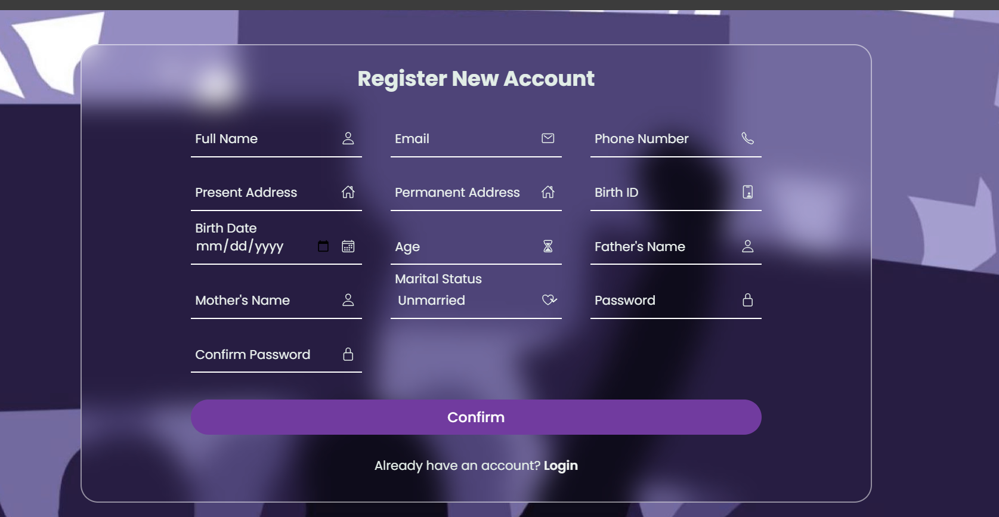
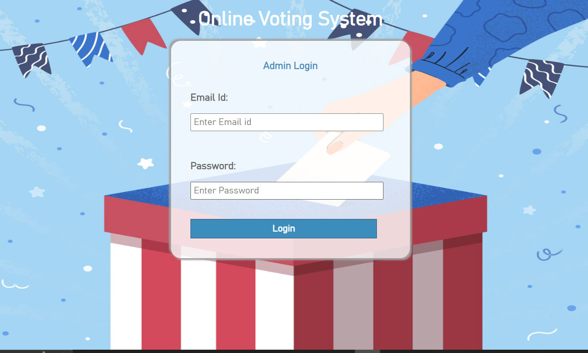
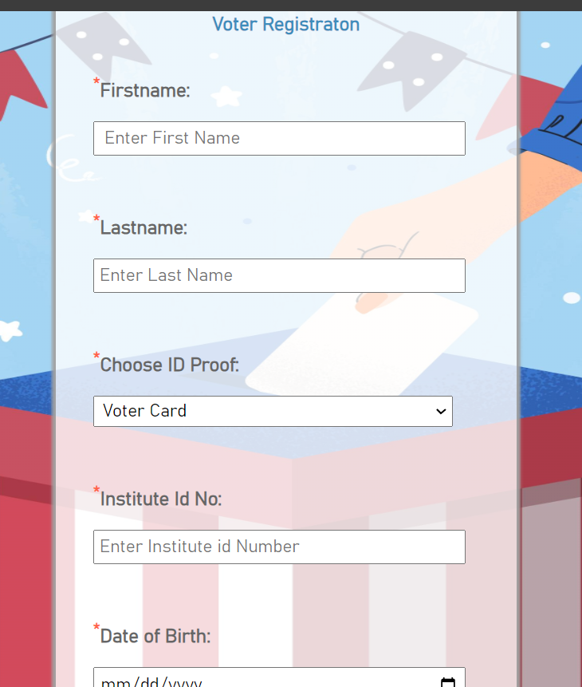
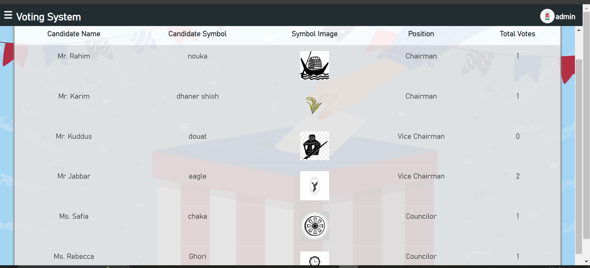
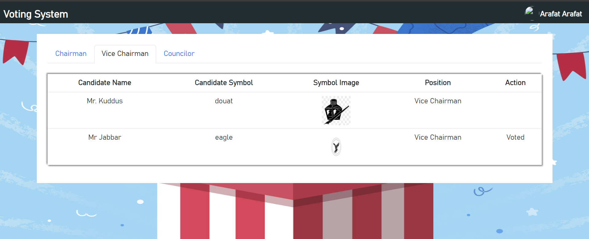
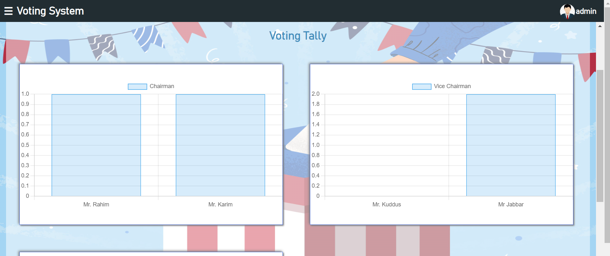

# Online Voting System

A secure web-based online voting system developed using PHP, MySQL, HTML, CSS, and JavaScript.  
The application allows registered users to log in and cast votes digitally, while administrators can manage candidates, monitor voting activity, and publish results through a dedicated admin panel.

---

## Features

### User Module
- User registration and authentication
- Secure login system
- Cast votes for available candidates
- Prevent duplicate voting
- View voting confirmation/status

### Admin Module
- Admin dashboard
- Manage candidates and voters
- Monitor election activity
- View and publish voting results
- Database management functionalities

---

## Technologies Used

### Frontend
- HTML5
- CSS3
- JavaScript

### Backend
- PHP

### Database
- MySQL

---

## Project Structure

```bash
vote/
│
├── admin/                 # Admin panel files
├── css/                   # Stylesheets
├── js/                    # JavaScript files
├── images/                # Project images/assets
├── includes/              # Database/configuration files
├── screenshots/           # Application screenshots
├── index.php              # Main entry point
└── README.md
```

---

## Screenshots

### Login Page



### Voting Dashboard





---

## Installation & Setup

### 1. Clone the Repository

```bash
git clone https://github.com/mayeshakader/vote.git
```

### 2. Configure Environment

Make sure the following are installed:

- PHP
- MySQL
- XAMPP Server

### 3. Create Database

- Create a MySQL database
- Import the provided SQL file into phpMyAdmin

### 4. Configure Database Connection

Update database credentials inside the configuration file.

Example:

```php
$host = "localhost";
$user = "root";
$password = "";
$database = "voting_system";
```

### 5. Run the Project

Move the project folder into:

```bash
htdocs/
```

Start Apache and MySQL from XAMPP, then open:

```bash
http://localhost/vote
```

---

## Future Improvements

- Email verification system
- OTP-based authentication
- Live result visualization
- Improved UI/UX design
- Election scheduling feature
- Enhanced security mechanisms

---

## Learning Outcomes

This project helped in understanding:

- Web application development using PHP
- Database integration with MySQL
- Authentication systems
- CRUD operations
- Admin panel management
- Client-server interaction

---


Interested in:
- Software Development
- AI Research
- NLP
- Data Mining
- Web & Mobile Applications

---

## License

This project is developed for educational and academic purposes.
